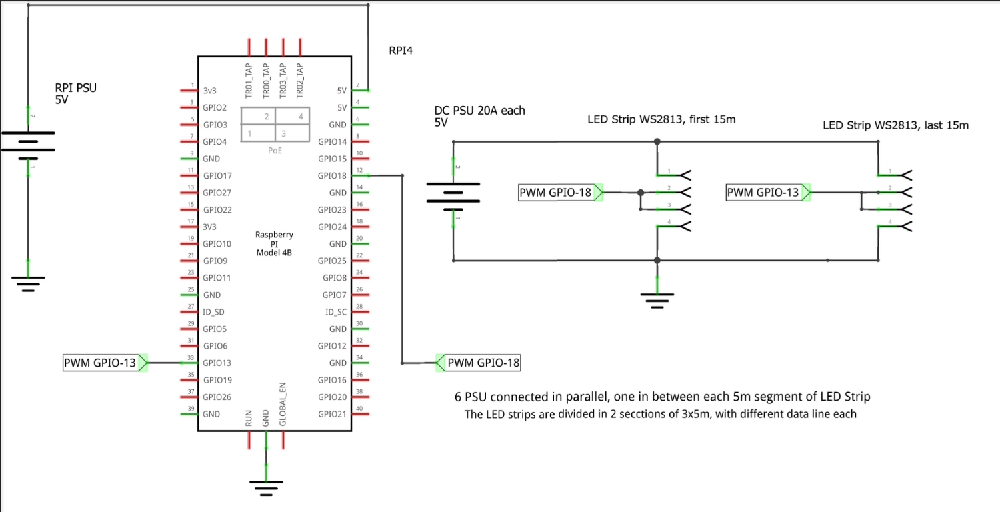

## TrussSense — Presence Lighting Infrastructure

### Abstract
This project provides an open, reproducible LED infrastructure for telepresence on an OptiTrack truss. WS2813 strips are mounted to the truss and driven from a Raspberry Pi via a FastAPI service exposing programmable effects and direct color control. The system integrates with Home Assistant and supports non‑invasive human monitoring (e.g., heart rate via Playwright) to map real‑time biosignals to ambient light displays that communicate mood and presence. The emphasis is infrastructure: clear APIs, modular effects, and end‑to‑end setup so anyone can re‑create the installation from scratch.

FastAPI service to control WS2813 (WS281x‑compatible) LED strips mounted on a truss. Provides REST endpoints for direct color control and several animated visual effects, including integrations for Home Assistant and a heart‑rate visualization.

### Features
- Direct control: clear, set color, set brightness, color by range
- Effects: bitcoin, glow, wave, color wipe, color fade, sparkle, rainbow, rainbow cycle, theater chase, running, heart‑rate
- Heart‑rate visualization using Playwright (Chromium headless)
- Home Assistant Lovelace controls and automations

---

### Hardware
- **Raspberry Pi 4B** with PWM-capable GPIO pins (Pi 5 not supported)
- **WS2813 LED strips** (30m total: 2x 15m sections, ~60 LEDs/meter)
- **6x 5V/20A DC Power Supply Units** (one every 5m for power injection)
- **Common ground** between LED power supply and Raspberry Pi

**Wiring Configuration:**
- **Strip 1 (15m)**: 896 LEDs on GPIO18 (Pin 12), 3x 5m segments with power injection
- **Strip 2 (15m)**: 894 LEDs on GPIO13 (Pin 33), 3x 5m segments with power injection
- **Total**: 1790 LEDs (~60 LEDs/meter × 30 meters)
- **Note**: Some LEDs were removed due to damage/burnout, reducing count from theoretical 1800
- **Power**: 6x 5V/20A PSUs connected in parallel, one between each 5m segment
- **Ground**: Connect all LED GND to Pi GND (common ground reference)
- **Data**: Connect LED data-in (DI) and backup data-in (BI) to respective GPIO pins

**Wiring Diagram**: 



> **📋 Hardware Setup**: The wiring diagram above shows the complete circuit layout including power injection points, GPIO connections, and proper grounding. Follow this diagram exactly for optimal performance.

**Safety Notes:**
- Each LED can draw up to ~60mA at full white (total ~108A for 1800 LEDs)
- Power injection every 5m prevents voltage drop on long runs
- Never power LED strips from Pi 5V pin
- Use proper fusing and circuit protection
- LED density: 60 LEDs per meter (standard WS2813 strip)

---

### Software Prerequisites (on Raspberry Pi)
- **Raspberry Pi 4B or earlier** (Pi 5 not supported due to `rpi-ws281x` library limitations)
- **Python 3.9+**
- **System packages**: `libatlas-base-dev` (for numpy performance), chromium dependencies for Playwright
- **Python packages**: See `requirements.txt` for exact versions
- **Optional but recommended**: Python virtual environment

---

### Installation
```bash

# Clone repository
cd ~/
git clone https://github.com/IERoboticsAILab/led_truss.git
cd led_truss

# Create and activate virtual environment
python3 -m venv venv
source venv/bin/activate

# Install Python packages
pip install -r requirements.txt

# Install Playwright browser (required for heart-rate effect)
python -m playwright install chromium
```

**Note**: If you don't need the heart-rate effect, you can skip the Playwright installation.

---

### Configuration
The default configuration matches the wiring diagram:
- **Strip 1**: 896 LEDs on GPIO18 (Pin 12) - 15m section (~60 LEDs/meter)
- **Strip 2**: 894 LEDs on GPIO13 (Pin 33) - 15m section (~60 LEDs/meter)
- **Total**: 1790 LEDs across 30m of WS2813 strips (reduced from 1800 due to damaged LEDs)

To modify the configuration, edit `app/core/truss.py`:
```python
def __init__(self, strip1_count=896, strip2_count=894, strip1_pin=18, strip2_pin=13, freq=800000, dma=10, brightness=125):
```

**Parameters:**
- `strip1_count` / `strip2_count`: Number of LEDs per strip
- `strip1_pin` / `strip2_pin`: GPIO pins for data lines
- `brightness`: Initial brightness (0-255)

---

### Running the API
```bash
cd ~/led_truss
source venv/bin/activate
sudo python -m uvicorn app.main:app --host 0.0.0.0 --port 8000
```

**Important Notes:**
- `sudo` is required for `rpi_ws281x` to access PWM hardware

### Systemd Service (Optional)
For production deployment, create a systemd service:

```bash
# Copy the provided service file
sudo cp led_truss.service /etc/systemd/system/

# Reload and enable the service
sudo systemctl daemon-reload
sudo systemctl enable --now led-truss
```

The service file is included in the repository and configured for the default installation path.

---

### Quick start (curl)
```bash
# Set all LEDs to white
curl -X POST http://<pi-ip>:8000/control/set-color

# Rainbow cycle (runs continuously until stopped)
curl -X POST http://<pi-ip>:8000/effects/rainbow-cycle -H "Content-Type: application/json" -d '{"wait_ms":50}'

# Clear
curl -X POST http://<pi-ip>:8000/control/clear
```

See the API quick reference below.

---

### API overview
- Root: `GET /` → welcome message
- Effects map: `GET /effects` → returns metadata from `effects_map.json`
- Direct control endpoints are under `/control/*`
- Effects endpoints are under `/effects/*`

See the API quick reference below.

---

### Home Assistant integration
This repository includes example YAML under `home_assistant_config/`:
- `rest_commands.yaml` builds the correct endpoint URL and payloads
- `input_numbers.yaml`, `input_booleans.yaml`, `input_selects.yaml`, `input_texts.yaml` provide UI helpers
- `lights.yaml` defines a color picker helper light
- `automations.yaml` keeps the helper light and RGB inputs in sync
- `lovelace_led_control.yaml` is a dashboard layout for controls

**Prerequisites:**
- Install `custom:light-entity-card` from HACS for the RGB color picker functionality

**Setup Steps:**
1. Copy the YAML contents into your Home Assistant configuration (adjust IPs).
2. Ensure the REST command URL points to your Pi IP.
3. Reload YAML / restart, then add the Lovelace dashboard JSON as a view.

**Heart Rate Integration**: The heart-rate effect works by scraping [HypeRate.io](https://www.hyperate.io) URLs that display real-time heart rate data. The default URL in the Home Assistant config is `https://app.hyperate.io/15875` - replace this with your personal HypeRate session URL. The effect looks for elements with the `.heartrate` class and maps heart rate values to colors (green→yellow→red).

---

### Project layout
```text
app/
  core/           # Hardware controller and DI
  effects/        # Effects metadata loader
  models/         # Pydantic request schemas
  routers/        # FastAPI routers (/control, /effects)
assets/           # Wiring diagram and other assets
home_assistant_config/  # Example HA integration YAML
effects_map.json  # Descriptions and defaults for effects
requirements.txt  # Python dependencies
led_truss.service # Systemd service file
```

---

### API quick reference

All effects run continuously until a new effect starts or you clear the LEDs. To stop and clear: `POST /control/clear`.

- Base URL: `http://<pi-ip>:8000`
- OpenAPI docs: `http://<pi-ip>:8000/docs`
- Effects metadata (names, params, defaults): `GET /effects`
 
Control endpoints:
- `POST /control/clear` — no body
- `POST /control/set-color` — `{ "color": {"r": 255, "g": 255, "b": 255 } }` (optional color)
- `POST /control/set-brightness` — `{ "brightness": 125 }`
- `POST /control/set-color-range-percent` — `{ "color": {..}, "start_percent": 0.0, "end_percent": 1.0 }`
- `POST /control/set-color-range-exact` — `{ "color": {..}, "start_index": 0, "end_index": 1800 }`

Effects endpoints (see `GET /effects` for full parameter schemas):
- `POST /effects/bitcoin` — `{ "time_threshold_in_secs": 30 }`
- `POST /effects/glow` — `{ "color": {..}, "wait_ms": 10 }`
- `POST /effects/wave` — `{ "color": {..}, "cycles": 1, "speed": 0.1, "wait_ms": 10 }`
- `POST /effects/color-wipe` — `{ "color": {..}, "wait_ms": 50 }`
- `POST /effects/color-fade` — `{ "color_from": {..}, "color_to": {..}, "wait_ms": 20, "steps": 100 }`
- `POST /effects/sparkle` — `{ "color": {..} | null, "wait_ms": 50, "cummulative": false }`
- `POST /effects/rainbow` — `{ "wait_ms": 50 }`
- `POST /effects/rainbow-cycle` — `{ "wait_ms": 50 }`
- `POST /effects/theater-chase` — `{ "color": {..} | null, "wait_ms": 50 }`
- `POST /effects/running` — `{ "wait_ms": 10, "width": 1 }`
- `POST /effects/heart-rate` — `{ "url": "https://...", "poll_interval": 1.0, "min_hr": 40, "yellow_start": 75, "red_start": 120, "max_hr": 200 }`

Notes:
- Start a new effect to stop the previous one automatically.
- Use `/control/clear` to stop and turn off all LEDs.

### License
MIT (or your preferred license). Update as appropriate.
